# Cure-Point

```markdown
# 🏥 Cure-Point: Hospital Management System

A streamlined Java and SQL solution for efficient patient and doctor record management, ensuring smooth and accurate hospital operations.

<!-- Badge Row -->
[](https://github.com/shivanshsoni04/Cure-Point)
[](https://github.com/shivanshsoni04/Cure-Point)
[](https://github.com/shivanshsoni04/Cure-Point/stargazers)
[](https://github.com/shivanshsoni04/Cure-Point/network/members)


## ✨ Key Features

*   📊 **Comprehensive Record Management:** Efficiently store and retrieve detailed patient and doctor information.
*   📝 **Streamlined Admissions & Discharges:** Simplify the patient lifecycle from entry to exit with intuitive processes.
*   🔍 **Accurate Data Handling:** Ensure data integrity and minimize manual errors with a robust SQL backend.
*   💻 **User-Friendly Interface:** Navigate the system with ease thanks to a clear and intuitive design built in Java.
*   🔒 **Secure Data Storage:** Protect sensitive patient and doctor data using established database security practices.


## 🚀 Getting Started

Follow these steps to set up and run Cure-Point on your local machine.

### Prerequisites

Before you begin, ensure you have the following installed:

*   **Java Development Kit (JDK):** Version 8 or higher.
*   **MySQL Server:** A running instance of MySQL.
*   **MySQL Connector/J:** The JDBC driver for MySQL (included in the repository as `mysql-connector-java-8.0.28.jar`).

### Manual Installation

1.  **Clone the Repository:**
    ```bash
    git clone https://github.com/shivanshsoni04/Cure-Point.git
    cd Cure-Point
    ```

2.  **Set up MySQL Database:**
    *   Log in to your MySQL server.
    *   Create a new database for Cure-Point. For example:
        ```sql
        CREATE DATABASE cure_point_db;
        USE cure_point_db;
        ```
    *   Create the necessary tables (e.g., `patients`, `doctors`, `admissions`, `discharges`). You will need to create the schema based on the application's requirements. A sample schema might look like this:
        ```sql
        CREATE TABLE patients (
            patient_id INT PRIMARY KEY AUTO_INCREMENT,
            first_name VARCHAR(50) NOT NULL,
            last_name VARCHAR(50) NOT NULL,
            date_of_birth DATE,
            gender VARCHAR(10),
            contact_number VARCHAR(15),
            address VARCHAR(255)
        );

        CREATE TABLE doctors (
            doctor_id INT PRIMARY KEY AUTO_INCREMENT,
            first_name VARCHAR(50) NOT NULL,
            last_name VARCHAR(50) NOT NULL,
            specialization VARCHAR(100),
            contact_number VARCHAR(15)
        );

        -- Add other tables like 'admissions', 'discharges' as per your application logic
        ```
    *   Ensure your application's database connection settings (e.g., `DB_URL`, `DB_USER`, `DB_PASSWORD`) in the Java source code are configured to connect to your MySQL database.

3.  **Configure Project Dependencies:**
    *   Open the project in your preferred Java IDE (e.g., IntelliJ IDEA, Eclipse).
    *   Add `mysql-connector-java-8.0.28.jar` to your project's build path/module dependencies. In IntelliJ IDEA, this is typically done via `File > Project Structure > Modules > Dependencies`.

4.  **Compile and Run:**
    *   Build the project within your IDE.
    *   Run the main application class (e.g., `com.curepoint.MainApplication` if one exists).


## 💡 Usage

Once the application is running, you can interact with the system through its graphical user interface (GUI).

*   **Patient Management:** Add new patients, view existing patient records, update details, or search for specific patients.
*   **Doctor Management:** Register new doctors, manage their specializations, and update contact information.
*   **Admission/Discharge:** Process patient admissions by assigning beds and doctors, and manage discharges upon patient recovery.

```java
// Example of how to start the application (assuming a main class exists)
public class MainApplication {
    public static void main(String[] args) {
        // Initialize database connection
        // Launch the main GUI window
        System.out.println("Cure-Point Hospital Management System started.");
        // Example: new MainFrame().setVisible(true);
    }
}
```


*A placeholder for a screenshot of the application in action.*


## 🗺️ Project Roadmap

Cure-Point is continuously evolving! Here are some planned enhancements and future goals:

*   ⭐ **Appointment Scheduling:** Implement a robust system for managing doctor appointments.
*   📈 **Reporting & Analytics:** Add modules for generating reports on patient statistics, doctor performance, and hospital occupancy.
*   🌐 **Web-Based Interface:** Explore developing a web front-end for broader accessibility.
*   📱 **Mobile Application Support:** Develop companion mobile applications for quick access and notifications.
*   🔄 **Third-Party Integrations:** Integrate with external billing systems or insurance providers.
*   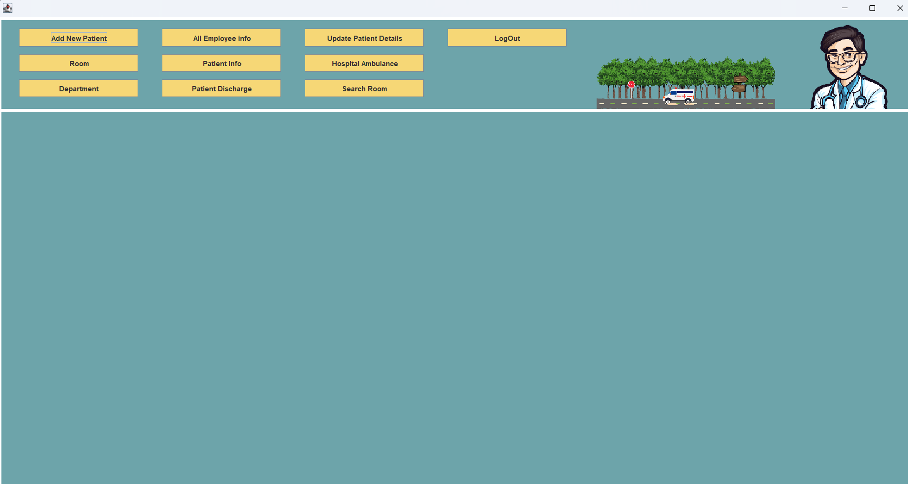
## 🔹 Glimpses of the Project

Take a look at some key screens and features of the **Hospital Management System**:


| Login_demo | Login_Credentials | Patient_Form | Patient_Details | Room_Details |
|--------------|--------------|--------------|--------------|--------------|
| 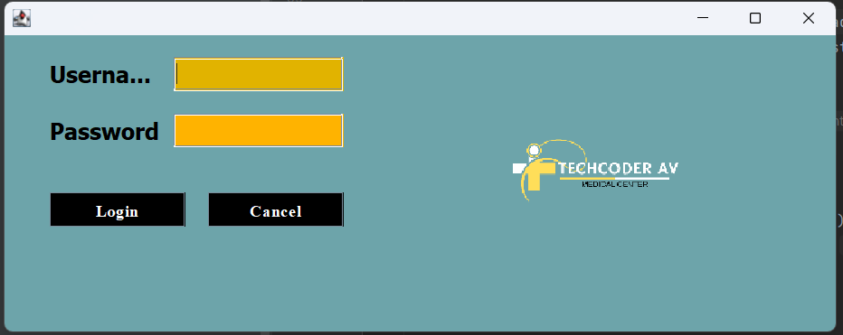 | 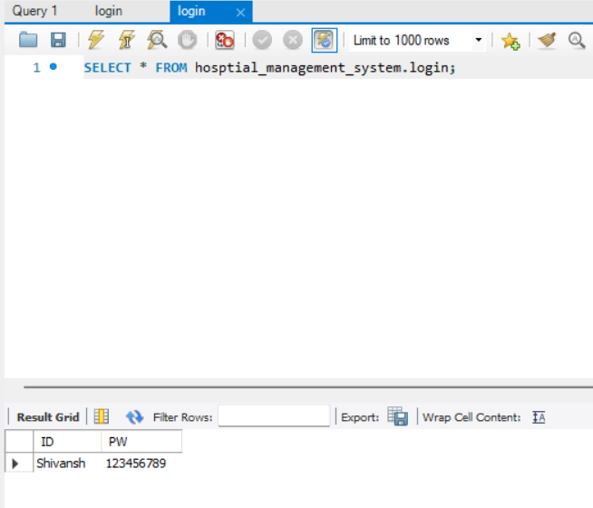 | 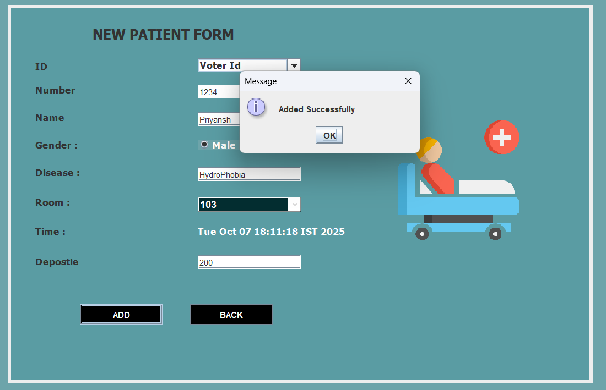 | 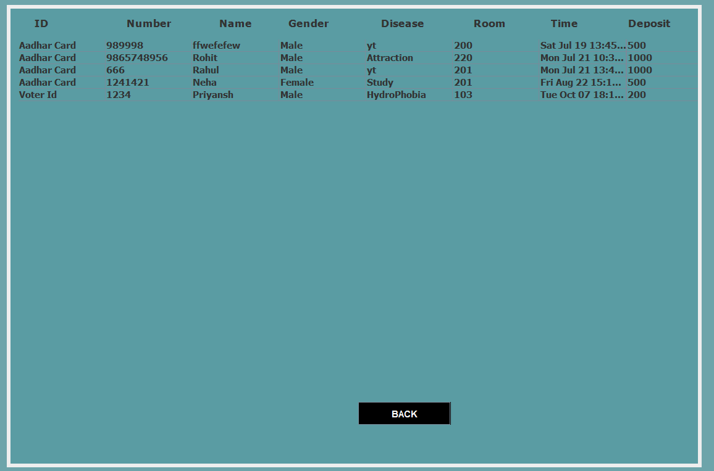 | 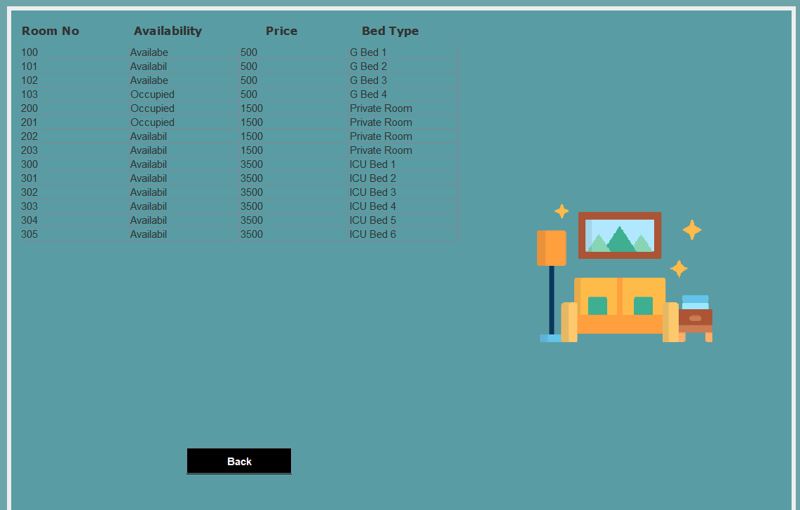 |

| Room_Status | CheckOut | CheckOut-Discharge | Department | checkOut-Updates |
|--------------|--------------|--------------|--------------|---------------|
| 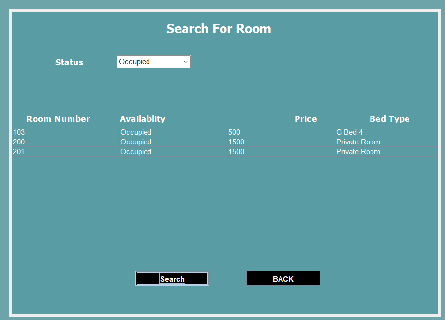 | 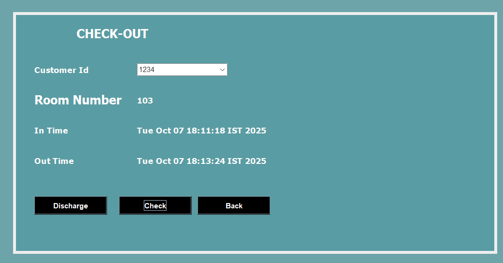 | 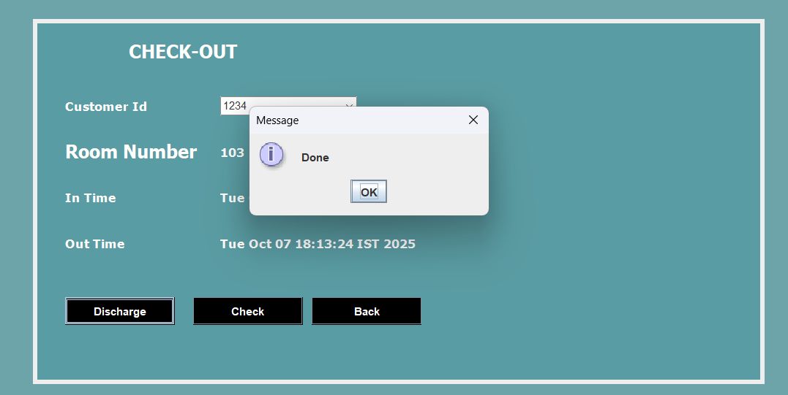 | 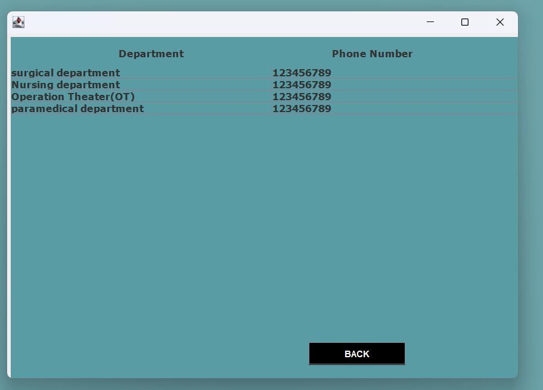 | 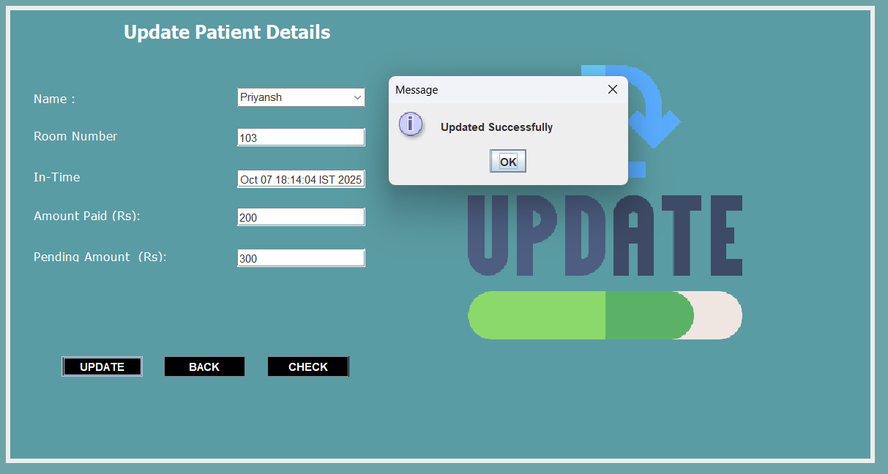 |


## 🤝 Contributing

We welcome contributions to Cure-Point! If you'd like to contribute, please follow these guidelines:

*   **Code Style:** Adhere to standard Java coding conventions (e.g., Google Java Style Guide). Maintain consistent formatting throughout the codebase.
*   **Branch Naming:** Use descriptive branch names for your features or bug fixes, such as `feature/add-appointments` or `bugfix/fix-patient-search`.
*   **Pull Request Process:**
    1.  Fork the repository.
    2.  Create your feature branch (`git checkout -b feature/your-feature`).
    3.  Commit your changes (`git commit -m 'feat: Add new feature'`).
    4.  Push to the branch (`git push origin feature/your-feature`).
    5.  Open a Pull Request to the `main` branch with a clear description of your changes.
*   **Testing:** Include unit tests for new features or bug fixes to ensure stability and prevent regressions.


## 📄 License

This project is currently not licensed. All rights are reserved by the author(s).

Copyright (c) 2023 shivanshsoni04
